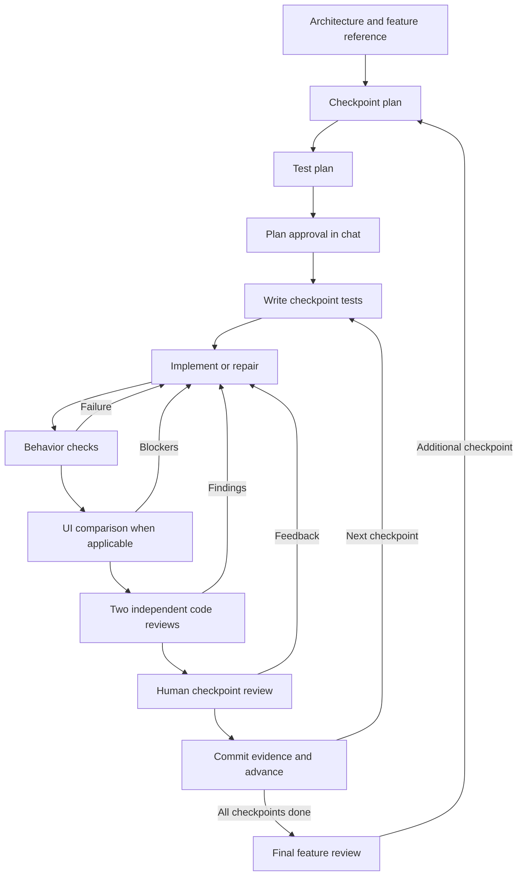

# Helix Loop workflow reference

Source reference, 2026-10-01, for [Helix Loop at `c52ba265a778c17c11757ef86630686728d6aa02`](https://github.com/johnarks/helix-loop/tree/c52ba265a778c17c11757ef86630686728d6aa02). Remote HEAD still matches this commit at inspection. This guide describes the intended skill procedure and its artifacts. It is separate from the [adoption assessment](helix-loop-assessment.md) and does not change the [agreed trial design](helix-design.md). The viewer was exercised with the supplied example. The agent workflow was not installed or executed.

## Orchestrator connects the roles

The orchestrator reads the architectural standard, retained feedback, and feature reference first. It commissions a baseline build check and checkpoint planning in parallel, then test planning. The baseline checker returns the working commands. The human reviews the checkpoint sequence in the viewer and approves through chat. The checkpoint-planner description says to run after the baseline check, while the orchestrator explicitly launches both together. This is an ordering difference in the instructions. [Initial inputs and baseline check][orchestrator-start], [planning order][planning-order], [plan review][plan-review], [planner description][checkpoint-description].

The intended sequence is shown below. A failed gate returns work for correction and renewed checks. A review correction reruns affected behavior checks and visual review when the visible result changes. The supplied skills and reports describe the coordination protocol. The executable support consists of the installer, Stop hook, and plan viewer. [Build roles][build-roles], [review correction][review-loop], [human review and final changes][human-loop], [installer][installer], [hook][hook], [viewer][viewer].

## Files carry the handoffs

The following table maps outputs to their consumers. Paths describe the clone's layout. [Design output][design-shape], [checkpoint output][checkpoint-output], [test output][test-output], [prototype output][prototype-output], [gate evidence][ui-output], [review evidence][review-output], [state initialization][state-initialization], [checkpoint commit][checkpoint-commit].

| Artifact | Producer | Reader or purpose |
| --- | --- | --- |
| `design.md` or existing architecture document | Design planner | Planning, implementation, prototype construction, and code review |
| `.helix/checkpoints.json` | Checkpoint planner | Orchestrator, test planner, and human plan viewer |
| `.helix/test-plan.md` | Test planner | Test-writing agents and checkpoint test execution |
| Application code and executable tests | Implementing and test-writing agents | Test runner and code reviewers |
| `.helix/prototype/<name>.html` | Prototype builder | Visual reference with reachable comparison states |
| `.helix/state.json` | Orchestrator | Current checkpoint and gate labels consumed by the Stop hook |
| `.helix/evidence/<id>/ui-review/` | UI review process | Captured screenshots and located findings |
| `.helix/evidence/<id>/adversarial/` | Code review process | Review rounds, repairs, reruns, and final verdicts |
| `.helix/evidence/<id>/` | Orchestrator archives results | Checkpoint evidence included in its commit |
| `.helix/learnings.md` | Human feedback retained by the orchestrator | Input to later planning, implementation, and code review |

The plan schema requires `version`, `target`, and an ordered `checkpoints` array. Each checkpoint requires `id`, `title`, `description`, `needs_ui_gate`, and `done_criteria`. Array order supplies build order. Progress fields and an evidence path can also appear in plan entries. The separate state example instead indexes checkpoints by ID and names `current_checkpoint`. [Plan schema][plan-schema], [state example][state-example].

## Design planner establishes the shared standard

Use this role when no written architecture standard exists. Its inputs are the existing code, components, and design assets, with human answers for unresolved choices about state, data flow, and errors. It produces a concise, prescriptive document so a reviewer can connect a finding to a specific rule. Its completion test is whether someone with only the document and a diff can write cited findings. [Design planner process][design-process], [completion condition][design-shape].

The output is root `design.md`, or additions to an existing `ARCHITECTURE.md`. Its sections cover principles, technology and module boundaries, component reuse, exact visual tokens, state and data flow, errors, code standards, and platform UI rules. The supplied template makes loading, empty, and error states explicit. This combines the standard used by the prototype builder with the standard used by code reviewers. [Document structure][design-shape], [design template][design-template].

Design planning precedes prototype creation when the design standard is missing. Checkpoint planning also receives the architecture document, so it can divide the desired behavior within those constraints. The practical detail to borrow is a standard that reviewers can cite, supplied to planning and implementation rather than rediscovered during review. [Prototype prerequisites][prototype-output], [checkpoint inputs][checkpoint-inputs].

## Checkpoint planner makes the sequence reviewable

The inputs are the migration reference, or a feature description with designs and documents, plus architecture guidance and retained feedback. The planner produces `.helix/checkpoints.json` and returns ordered titles with a brief reason for the sequence. Ambiguities go to the orchestrator with proposed answers before scope is guessed. [Inputs and output][checkpoint-inputs], [questions and summary][checkpoint-output].

The ordering starts with a foundation, then a deliberately small section. Later checkpoints grow after the early decisions pass review. Each has a short title, a paragraph of scope, independently checkable done criteria, and `needs_ui_gate`. A worker should be able to hold the scope and reference excerpt in a small context. The skill suggests four to eight checkpoints for a screen, with more for larger work. [Splitting rules][checkpoint-split].

The useful pattern is to make the first checkpoint test an important foundation without requiring the whole feature. The title sequence gives the human one compact planning decision, while criteria give the test author and implementer a concrete outcome. The clone stores the whole sequence in one JSON file. Individual checkpoint files remain part of our separate trial design. [Planner scope and summary][checkpoint-split], [planner output][checkpoint-output].

## Test planner defines expectations before code

After checkpoint planning, a separate agent creates the behavior test plan. It works from each checkpoint's scope and describes observable user behavior rather than internal calls. Its edge-case categories include invalid inputs, empty states, permission denials, boundaries, and failures. Tests use a CLI or integration harness where available and avoid browser or simulator work at this stage. [Test planning order][planning-order], [test principles][test-rules].

The output is `.helix/test-plan.md`. Its shape repeats a checkpoint heading, a `Setup` section for fixtures or seed data, and a `Cases` section. Cases are Markdown checklist entries with a `TC-01` style identifier, a behavior description, and the expected outcome. The planner returns case and edge-case counts per checkpoint. Shared fixtures stay explicit, and each checkpoint's cases assess its own scope. [Test plan format][test-output], [scope rule][test-rules].

Separate test-writing agents turn that plan into executable tests before implementation. A fresh implementer receives the checkpoint description, criteria, relevant reference excerpt, architecture, and feedback. A separate runner executes the checkpoint suite. When tests fail, the implementer repairs code and the runner executes tests again. The clone also directs tests to fail initially. These are delegation instructions, not separate executable tools supplied by the pack. [Tests, implementation, and execution][build-roles].

The detail worth borrowing is the handoff chain: expectation author, test author, implementer, and observing runner. The test case list exists before implementation and can remain the common reference during repair. [Test author handoff][test-output], [build role sequence][build-roles].

## Prototype builder creates a stateful visual reference

For a new feature without a reference app, this role consumes `design.md` or the project's design tokens and components. Its output is `.helix/prototype/<name>.html`, a single file with inline CSS and JavaScript. It requires no build step or network dependencies. Buttons, tabs, forms, and navigation respond to interaction. [Prototype output contract][prototype-output].

Empty, filled, loading, error, and submitted states must be reachable through interactions or a review toolbar. The builder starts with the simplest states, opens the file, and exercises every interaction. A comment at the top names the states available for comparison, using a `STATES` list. This gives the UI reviewer a concrete inventory rather than a screenshot of one happy path. [State coverage and process][prototype-process].

The implementation must match the prototype's declared states in structure, spacing, alignment, and behavior. When the human changes the design, the prototype changes first and affected checkpoints repeat UI review. The reference therefore changes deliberately before the implementation is judged against it. [Prototype and UI contract][prototype-contract].

## UI reviewers compare matching states within checkpoint scope

Gate 2 receives the reference app or prototype, implementation screenshots, and an explicit comparison scope. Reviewers work in fresh sessions without project instructions or implementation code. The skill assigns two emphases: one reviewer checks appearance, while the other checks interactions and state transitions. The orchestrator combines their reports into a verdict. [UI reviewer setup][ui-setup].

Both sides must show the same screen and state. A mismatched comparison returns `INVALID`, which causes recapture and another review. Scope covers only the checkpoint's implemented part, such as its navigation bar and title. Sizes are judged relative to screenshot dimensions, allowing comparison across different render sizes. [State matching, scope, and proportions][ui-protocol].

Each finding carries a description, `blocker` or `minor` severity, and an on-screen location. A visual difference fixable in code is a blocker by default. Passing requires zero blockers. The builder receives the findings, repairs the implementation, and repeats the gate. Screenshots and the report go under `.helix/evidence/<checkpoint-id>/ui-review/`. [Findings, verdict, and evidence][ui-output].

The concrete borrowing is a comparison request that names the state and built scope, followed by a report that says where each difference occurs. `INVALID` keeps a bad comparison distinct from an implementation defect. [UI protocol][ui-protocol].

## Adversarial reviewers evaluate code against documented rules

Gate 3 uses two independent reviewers with the same remit. Each receives the checkpoint diff, architecture including UI rules, and retained feedback. Neither receives the builder's reasoning, the test plan, or the other reviewer's report. Both examine layering, component patterns, naming, error handling, security basics, and test quality. The appearance-versus-behavior split belongs to the UI role, not this pair. [Code reviewer inputs and remit][review-setup], [UI emphases][ui-setup].

A finding identifies file, line, violated rule, and severity. A fresh builder repairs the findings. Affected behavior tests run again, and visible changes also trigger UI review. The code reviewers then examine the changed code again. The loop finishes only after both approve with no outstanding findings. [Review and repair loop][review-loop].

The output directory is `.helix/evidence/<checkpoint-id>/adversarial/`. It retains each round's findings, repairs, test reruns, and both final approvals. This makes the correction sequence inspectable. The useful pattern is to give reviewers a cited standard and keep review, repair, and re-examination as distinct activities. [Review evidence][review-output], [review loop][review-loop].

## Human feedback becomes input for later checkpoints

Checkpoint review presents the built result, tests, UI summary, and code-review verdicts. Feedback goes into `.helix/learnings.md`, then a builder addresses it and reruns affected gates. Final feature review can produce new checkpoints that follow the same procedure. [Human review and final changes][human-loop].

The feedback template groups entries by date and checkpoint. Each entry records the issue, the human's preference, and the checkpoint that exposed it. Its examples connect a coding preference to later code review, and a missed empty state to updating the prototype first. Planners, implementers, and code reviewers subsequently receive that file. Retaining specific feedback with its origin is the concrete detail to borrow. [Feedback template][learnings], [planner inputs][checkpoint-inputs], [implementation context][build-roles], [review inputs][review-setup].

## Supplied example shows a complete checkpoint sequence

The settings-screen example makes increasing scope concrete. Its four checkpoints move from navigation to content, persistence, and session behavior. All begin as planned, with pending gates except the final checkpoint's skipped UI gate. [Checkpoint example][checkpoint-example].

| Checkpoint | Contribution and checks illustrated |
| --- | --- |
| `cp-01` | Screen shell with a title, back navigation, and an empty container with the expected spacing |
| `cp-02` | User profile data and layout, including absent or long names |
| `cp-03` | Preference controls that reload stored values, survive restart, and show platform-disabled notifications |
| `cp-04` | Sign-out clears credentials, prevents navigation into the old session, and protects data during pending synchronization. `needs_ui_gate` is false. |

The separate state example shows `cp-01` complete and `cp-02` in progress. Its behavior gate has passed while UI, code review, and human review remain pending. This illustrates intermediate progress. It is an example record rather than evidence that those checks ran. [State example][state-example].

## Viewer presents the plan for review

The viewer is a standalone HTML file. It accepts a dropped or chosen JSON file, or tries to fetch `checkpoints.json` relative to its own URL. Cards display scope, done criteria, status, and gate labels. The progress bar counts entries marked `done`. UI labels are omitted for checkpoints with `needs_ui_gate: false`, and approval happens in chat. The viewer reads the plan supplied to it, not the hook's separate state file. [Viewer display and loading][viewer].

I served the pinned checkout locally and loaded its supplied checkpoint example into the viewer's rendering function. The observed display contained four cards, 15 gate labels, one UI-not-applicable annotation, and zero completed progress. The screenshot and [observation record](evidence/helix-loop-reference/viewer-observation.md) remain in the ignored evidence directory. This exercised presentation of the example, not approval recording or the agent loop.

The [local screenshot](evidence/helix-loop-reference/plan-viewer.png) shows the settings checkpoint example. This generated preview is available only in the current checkout.

[design-process]: https://github.com/johnarks/helix-loop/blob/c52ba265a778c17c11757ef86630686728d6aa02/skills/design-planner/SKILL.md#L8-L14
[design-shape]: https://github.com/johnarks/helix-loop/blob/c52ba265a778c17c11757ef86630686728d6aa02/skills/design-planner/SKILL.md#L16-L48
[design-template]: https://github.com/johnarks/helix-loop/blob/c52ba265a778c17c11757ef86630686728d6aa02/templates/design-template.md#L1-L47
[checkpoint-inputs]: https://github.com/johnarks/helix-loop/blob/c52ba265a778c17c11757ef86630686728d6aa02/skills/checkpoint-planner/SKILL.md#L10-L13
[checkpoint-split]: https://github.com/johnarks/helix-loop/blob/c52ba265a778c17c11757ef86630686728d6aa02/skills/checkpoint-planner/SKILL.md#L15-L21
[checkpoint-output]: https://github.com/johnarks/helix-loop/blob/c52ba265a778c17c11757ef86630686728d6aa02/skills/checkpoint-planner/SKILL.md#L23-L33
[planning-order]: https://github.com/johnarks/helix-loop/blob/c52ba265a778c17c11757ef86630686728d6aa02/skills/orchestrator/SKILL.md#L20-L31
[test-rules]: https://github.com/johnarks/helix-loop/blob/c52ba265a778c17c11757ef86630686728d6aa02/skills/test-planner/SKILL.md#L8-L16
[test-output]: https://github.com/johnarks/helix-loop/blob/c52ba265a778c17c11757ef86630686728d6aa02/skills/test-planner/SKILL.md#L18-L36
[build-roles]: https://github.com/johnarks/helix-loop/blob/c52ba265a778c17c11757ef86630686728d6aa02/skills/orchestrator/SKILL.md#L53-L64
[prototype-output]: https://github.com/johnarks/helix-loop/blob/c52ba265a778c17c11757ef86630686728d6aa02/skills/prototype-builder/SKILL.md#L10-L16
[prototype-process]: https://github.com/johnarks/helix-loop/blob/c52ba265a778c17c11757ef86630686728d6aa02/skills/prototype-builder/SKILL.md#L14-L24
[prototype-contract]: https://github.com/johnarks/helix-loop/blob/c52ba265a778c17c11757ef86630686728d6aa02/skills/prototype-builder/SKILL.md#L26-L28
[ui-setup]: https://github.com/johnarks/helix-loop/blob/c52ba265a778c17c11757ef86630686728d6aa02/skills/ui-reviewer/SKILL.md#L10-L13
[ui-protocol]: https://github.com/johnarks/helix-loop/blob/c52ba265a778c17c11757ef86630686728d6aa02/skills/ui-reviewer/SKILL.md#L15-L25
[ui-output]: https://github.com/johnarks/helix-loop/blob/c52ba265a778c17c11757ef86630686728d6aa02/skills/ui-reviewer/SKILL.md#L20-L29
[review-setup]: https://github.com/johnarks/helix-loop/blob/c52ba265a778c17c11757ef86630686728d6aa02/skills/adversarial-review/SKILL.md#L10-L18
[review-loop]: https://github.com/johnarks/helix-loop/blob/c52ba265a778c17c11757ef86630686728d6aa02/skills/adversarial-review/SKILL.md#L20-L29
[review-output]: https://github.com/johnarks/helix-loop/blob/c52ba265a778c17c11757ef86630686728d6aa02/skills/adversarial-review/SKILL.md#L31-L33
[human-loop]: https://github.com/johnarks/helix-loop/blob/c52ba265a778c17c11757ef86630686728d6aa02/skills/orchestrator/SKILL.md#L81-L90
[learnings]: https://github.com/johnarks/helix-loop/blob/c52ba265a778c17c11757ef86630686728d6aa02/templates/learnings-template.md#L1-L15
[orchestrator-start]: https://github.com/johnarks/helix-loop/blob/c52ba265a778c17c11757ef86630686728d6aa02/skills/orchestrator/SKILL.md#L14-L25
[plan-review]: https://github.com/johnarks/helix-loop/blob/c52ba265a778c17c11757ef86630686728d6aa02/skills/orchestrator/SKILL.md#L47-L51
[checkpoint-description]: https://github.com/johnarks/helix-loop/blob/c52ba265a778c17c11757ef86630686728d6aa02/skills/checkpoint-planner/SKILL.md#L1-L4
[state-initialization]: https://github.com/johnarks/helix-loop/blob/c52ba265a778c17c11757ef86630686728d6aa02/skills/orchestrator/SKILL.md#L33-L44
[checkpoint-commit]: https://github.com/johnarks/helix-loop/blob/c52ba265a778c17c11757ef86630686728d6aa02/skills/orchestrator/SKILL.md#L81-L86
[installer]: https://github.com/johnarks/helix-loop/blob/c52ba265a778c17c11757ef86630686728d6aa02/install.sh
[hook]: https://github.com/johnarks/helix-loop/blob/c52ba265a778c17c11757ef86630686728d6aa02/hooks/stop-gate-check.sh#L34-L85
[viewer]: https://github.com/johnarks/helix-loop/blob/c52ba265a778c17c11757ef86630686728d6aa02/viewer/index.html#L46-L118
[plan-schema]: https://github.com/johnarks/helix-loop/blob/c52ba265a778c17c11757ef86630686728d6aa02/schemas/checkpoints.schema.json
[checkpoint-example]: https://github.com/johnarks/helix-loop/blob/c52ba265a778c17c11757ef86630686728d6aa02/templates/checkpoints.example.json
[state-example]: https://github.com/johnarks/helix-loop/blob/c52ba265a778c17c11757ef86630686728d6aa02/examples/state.example.json
